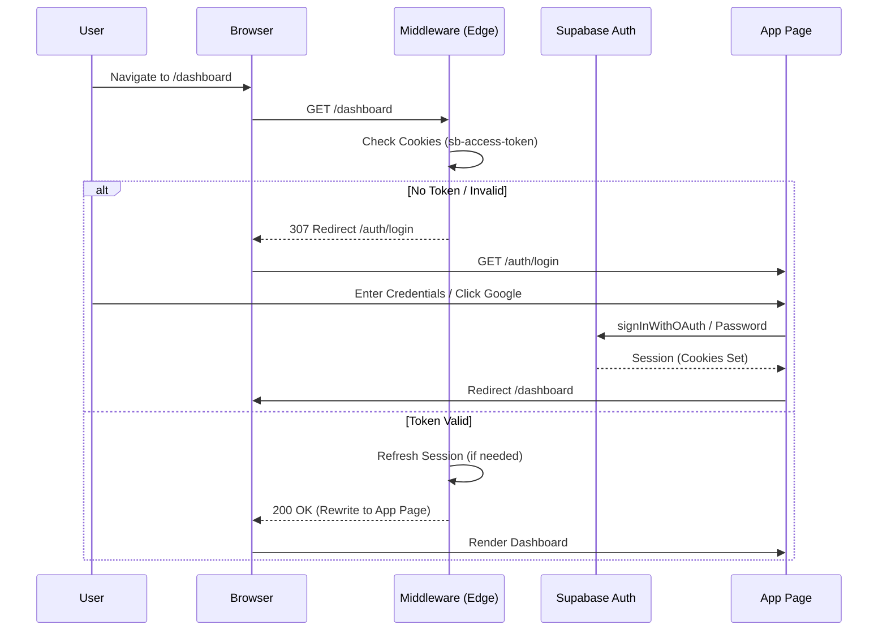

# Authentication Architecture
**Date:** January 28, 2026

## Auth Flow Diagram

## Core Components

### 1. The Edge Gatekeeper (`middleware.ts`)
This is the first line of defense. It runs on Vercel's Edge Network.
- **Why here?** To prevent unauthenticated requests from even hitting our React server components or database connections. It is fast and cheap.
- **Logic:**
  1. Checks if path is `PUBLIC_ROUTES`.
  2. If not, checks `supabase.auth.getUser()`.
  3. If invalid, redirects to Login.

### 2. The Identity Provider (Supabase Auth)
We outsource identity management to Supabase (GoTrue).
- **Responsibility:**
  - Salt/Hash passwords (bcrypt).
  - Handle Google OAuth handshake.
  - Issue JWTs (Access & Refresh tokens).
  - Handle Password Reset emails.

### 3. Server-Side Authentication
In API Routes (`app/api/*`) and Server Actions:
- We use `createClient()` (from `@/lib/supabase/server`).
- We **MUST** call `await supabase.auth.getUser()` to validate the session.
- We do **NOT** rely purely on cookies being present; we verify the signature via Supabase's library.

### 4. Client-Side State
- `createClient()` (from `@/lib/supabase/client`) is a singleton.
- It syncs auth state across tabs.
- Used for `useUser()` hooks in React components to show/hide UI elements (like "Log Out" buttons).

## Deep Linking Architecture
- When middleware intercepts a request (e.g. `/cohost/calendar/settings`), it appends `?next=/cohost/calendar/settings` to the login URL.
- The Login page preserves this query param.
- The OAuth callback handler preserves this param in the `state` object or query string.
- Result: User lands exactly where they intended after login.
