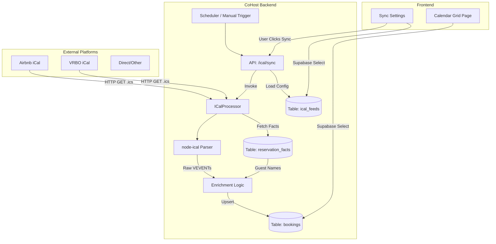

# Calendar System Architecture
**Date:** January 28, 2026

## High-Level Data Flow

## Core Subsystems

### 1. The Ingestion Engine (`ICalProcessor`)
The heart of the system. It runs purely on the backend (Next.js API Routes).
- **Input:** An iCal URL.
- **Process:**
    1. Downloads the raw text file.
    2. Validates generic iCal structure (`BEGIN:VCALENDAR`).
    3. Transforms "events" into "bookings".
    4. **Enrichment:** Attempts to find a matching "Reservation Fact" (from Gmail parsing) to replace "Blocked" with "Guest Name".
- **Output:** Writes to `bookings` table.

### 2. The Enrichment Layer
Bridging the gap between "blind" iCals and "rich" Emails.
- iCal feeds often redact guest names (showing only "Reserved" or "Airbnb User").
- Usage of `reservation_facts` table allows us to "hydrate" these bookings.
- **Matching Logic:** 
  - Match by **Confirmation Code** (Strongest).
  - Match by **Exact Date Range** + **Property** (Fallback).

### 3. The Visualization Layer (`CalendarPage`)
- Client-side React application.
- **Virtualization:** Uses CSS Grid and infinite scrolling to handle potentially thousands of bookings without DOM overload.
- **Logic:** Handles timezone stripping (interprets dates as "Property Local") to avoid off-by-one errors common in calendar apps.

### 4. Sync Management (`CalendarSettings`)
- CRUD for `ical_feeds`.
- Provides transparency into the "Black Box" of syncing by storing `last_http_status`, `last_response_snippet`, etc.
- Essential for debugging why a booking isn't showing up (e.g. "Airbnb returned 403 Forbidden").

## Scalability Considerations
- **Storage:** Bookings are normalized. 100 props * 365 days is manageable in Postgres.
- **Compute:** Syncs are processed sequentially per request or in parallel batches via Cron workers (coming soon).
- **Network:** Outbound HTTP requests to Airbnb/VRBO are the primary bottleneck. Timeouts are handled gracefully.
