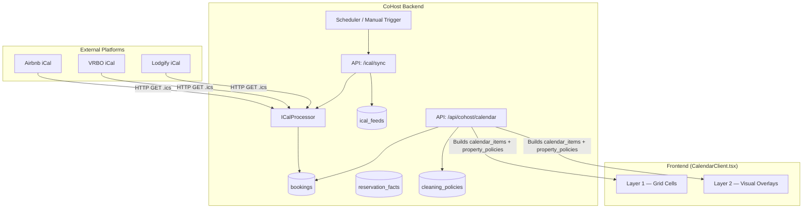

# Calendar System Architecture
**Last Updated:** April 3, 2026

---

## 1. High-Level Data Flow


```mermaid
graph TD
    subgraph "External Platforms"
        Airbnb[Airbnb iCal]
        VRBO[VRBO iCal]
        Lodgify[Lodgify iCal]
    end

    subgraph "CoHost Backend"
        Cron[Scheduler / Manual Trigger]
        APISync[API: /ical/sync]
        Processor[ICalProcessor]

        DB_Feeds[(ical_feeds)]
        DB_Bookings[(bookings)]
        DB_Facts[(reservation_facts)]
        DB_Policies[(cleaning_policies)]

        CalAPI[API: /api/cohost/calendar]
    end

    subgraph "Frontend (CalendarClient.tsx)"
        Layer1[Layer 1 — Grid Cells]
        Layer2[Layer 2 — Visual Overlays]
    end

    Airbnb -->|HTTP GET .ics| Processor
    VRBO -->|HTTP GET .ics| Processor
    Lodgify -->|HTTP GET .ics| Processor

    Cron --> APISync
    APISync --> DB_Feeds
    APISync --> Processor
    Processor --> DB_Bookings

    CalAPI --> DB_Bookings
    CalAPI --> DB_Policies
    CalAPI -->|Builds calendar_items + property_policies| Layer1
    CalAPI -->|Builds calendar_items + property_policies| Layer2
```

---

## 2. Backend: The Calendar API Route

**File:** `app/api/cohost/calendar/route.ts`

This is the single data source for the frontend calendar grid. It:

1. Fetches `bookings` for a date range + workspace
2. Fetches `cleaning_policies` for each property
3. **For policy-enabled properties** (where `cleaning_pre_days > 0` or `cleaning_post_days > 0`):
   - Suppresses Lodgify "Preparation Time" buffer blocks (they are redundant with the policy)
   - Generates explicit `type: 'cleaning'` items covering the pre/post-cleaning window
4. **For non-policy properties:**
   - All bookings pass through unchanged — including any Lodgify buffer blocks (which appear as unsuppressed iCal holds)
5. Returns two top-level keys:
   - `calendar_items[]` — all bookings (plus generated cleaning items) as flat list
   - `property_policies{}` — map of `property_id → { cleaning_pre_days, cleaning_post_days }`

**Critical invariant:** `type: 'cleaning'` items are ONLY generated for policy-enabled properties. Non-policy properties will never have `type: 'cleaning'` from this API, even if they receive Lodgify buffer holds. Those buffer holds come through as `type: 'booking'`.

---

## 3. Frontend: CalendarClient.tsx — The Two-Layer Architecture

> ⚠️ **CRITICAL:** The calendar UI renders in two completely independent, stacked CSS Grid layers. Any LLM working on this file MUST understand both layers before touching anything. Getting this wrong breaks the entire calendar.

### How the CSS Grid Works

The grid has:
- **Column 1:** Sticky sidebar (property names/images)
- **Columns 2…N:** One column per calendar day

Both Layer 1 and Layer 2 share the **exact same CSS Grid** (same `gridTemplateColumns`, same `gridRow` indices). They achieve depth by CSS stacking context (z-index), not by separate DOM hierarchies.

---

### Layer 1 — The Interactive Floor (Grid Cells)

**Code location:** Lines ~850–859  
**Rendered by:** `dates.map()` inside `properties.map()`  
**One element per:** property × date (every cell in the grid)  
**Z-index:** Default (auto / 0) — intentionally the LOWEST layer  
**Interactivity:** Currently none in the original codebase (selection was added in Phase 2)

```tsx
// Layer 1 — purely structural/background cells
{dates.map((date, colIdx) => (
  <div
    key={`${property.id}-day-${colIdx}`}
    className={`border-r border-gray-50 ${isWeekend ? 'bg-gray-50/30' : 'bg-white'} ${rowClass}`}
    style={{ gridRow: gridRow, gridColumn: colIdx + 2 }}
  />
))}
```

**What Layer 1 does:**
- Draws the grid background (white / weekend grey)
- Draws column borders
- Is the intended target for mouse events (selection, click-to-create)

**What Layer 1 does NOT do:**
- No booking data — it doesn't know what's on a given date
- No z-index — it sits below everything in Layer 2

---

### Layer 2 — The Visual Overlay (Booking/Broom Blocks)

**Code location:** Lines ~862–1176  
**Rendered by:** `propertyBookings.map()` (after dedup) inside `properties.map()`  
**One element per:** booking/cleaning item visible in the current window  
**Z-index:** `z-10` (cleaning), `z-20` (bookings), `z-0` (past)  
**Interactivity:** Booking pill inner div has `onClick` for navigation; outer wrappers should ideally be `pointer-events-none`

Layer 2 contains TWO sub-elements per booking:

#### 2a. The Booking Wrapper Div
```tsx
<div
  className={`relative ${isPast ? 'z-0' : (booking.type === 'cleaning' ? 'z-10' : 'z-20')}`}
  style={{
    gridRow: gridRow,
    gridColumn: `${start + 2} / span ${booking.type === 'cleaning' ? span : span + 1}`,
    height: ROW_HEIGHT,
  }}
>
```

- Spans `span + 1` columns for non-cleaning bookings — intentionally bleeds one column past checkout
- This "+1 bleed" is a **visual design choice** so hosts can see the booking extends to checkout day (11am checkout)
- The actual booking pill inside this stops short of the right edge with `right: CELL_WIDTH * 0.9`
- **WARNING:** This wrapper at z-20 covers the checkout-day cell in Layer 1, blocking clicks to that cell

#### 2b. The Standalone Checkout Broom (`STANDALONE CHECKOUT BROOM CELL`)
```tsx
{booking.type !== 'cleaning' && !policyEnabled && (
  <div
    className="relative pointer-events-none"
    style={{
      gridRow: gridRow,
      gridColumn: checkoutIndex + 2,  // ← Placed on checkout day column
      height: ROW_HEIGHT,
      zIndex: 20,
    }}
  >
    <div className="absolute pointer-events-none" ...>🧹</div>
  </div>
)}
```

- Renders a 🧹 emoji on the checkout day for non-policy properties
- Pure visual — hosts see "this day has a morning checkout, plan your cleaning"
- Is a **separate CSS Grid child** at `gridColumn: checkoutIndex + 2`
- Has `pointer-events-none` on both the outer and inner div
- **KNOWN ISSUE:** Despite `pointer-events-none`, this grid child at `zIndex: 20` still prevents clicks from reaching Layer 1 cells at its grid position in some browser/React combinations — because as a *sibling* grid item it competes for hit-testing with Layer 1 at the same grid coordinate

#### 2c. The Cleaning Block (Policy Properties Only)
```tsx
{booking.type === 'cleaning' && (
  <div className="absolute bg-amber-50 border-y border-x border-amber-200 ... pointer-events-none">
    <span className="text-2xl">🧹</span>
  </div>
)}
```

- Renders the amber/yellow cleaning block for policy-enabled properties
- Already has `pointer-events-none` on the inner amber div (correct)
- This IS a real block — hosts cannot create reservations on these days

---

### The Broom Disambiguation

There are **two visually similar but architecturally distinct** broom emojis:

| Feature | Standalone Checkout Broom | Policy Cleaning Block |
|---------|--------------------------|----------------------|
| Background | White (no background) | Amber/yellow cell |
| Trigger | Any booking checkout on non-policy property | `type: 'cleaning'` API item (policy-enabled property only) |
| Block selection? | **Should NOT** — it's decorative | **YES** — that date is truly unavailable |
| `pointer-events` | `none` (intended) | `none` on inner div |
| z-index | 20 (via inline style) | 10 (via Tailwind `z-10`) |

---

## 4. Deduplication Logic

Before rendering Layer 2, bookings are deduplicated by the key:
```
`${propertyId}|${startDate}|${endDate}|${type}`
```

When two bookings share this key, the "better" one wins using this priority:
1. Known source (Airbnb/VRBO/Direct) beats unknown iCal
2. Real guest name beats generic name ("Guest", "Reserved")

---

## 5. Enrichment States and Visual Rendering

| State | Condition | Visual |
|-------|-----------|--------|
| Fully enriched | `enrichedGuestName` set | Connection color fill |
| Manually resolved | `manuallyResolvedAt` set | Connection color fill |
| Legacy enriched | `matchedConnectionId` set | Connection color fill |
| Raw iCal with name | `guestName` not generic | Gray pill, name shown |
| Unenriched | Generic guest name | Gray pill, "Reservation" shown |
| Cleaner view | `userRole === 'cleaner'` | Pastel coral, all names masked |

---

## 6. Broom Click Problem — Root Cause Analysis (April 2026)

### The Problem
Clicking on the checkout-day broom cell for non-policy properties does not trigger date selection.

### Why It Happens
The calendar has two layers sharing the same CSS grid. The **booking wrapper div** in Layer 2 uses `span + 1` to visually bleed into the checkout day column. This wrapper sits at `z-20`.

Layer 1 grid cells (the intended click targets) sit at the default z-index (0/auto), which means Layer 2 always wins hit-testing.

Additionally, the **Standalone Checkout Broom** creates a *third* grid child at `gridColumn: checkoutIndex + 2, zIndex: 20`. Even with `pointer-events-none`, this grid sibling can compete with Layer 1 for event dispatch because siblings at a higher z-index own the hit area in CSS rendering.

### Correct Fix Approach (APPROVED — not yet applied)
**DO NOT apply without explicit owner approval each time.**

The fix requires two coordinated changes:
1. Add `pointer-events-none` to the **outer Layer 2 wrapper div** (line ~1039) — makes ALL overlay wrappers pass events through
2. Add `pointer-events-auto` back on the **inner booking pill div** (line ~1071) — restores click-to-navigate on real bookings
3. Add `onMouseDown`/`onMouseUp` selection handlers to **Layer 1 grid cells** (line ~853) with a policy-aware `isBooked` check

The `isBooked` check for Layer 1 must treat:
- `type: 'cleaning'` items → block only if `hasPolicyEnabled === true`
- All other bookings → block (they are real reservations)
- The checkout day itself (`b.endDate === dateStr` but `b.endDate > dateStr` is false) → NOT blocked (checkout day is selectable; this is what the broom visually signals)

**Why the broom itself doesn't need to change:** Once Layer 2 wrappers are `pointer-events-none`, the broom grid child's `pointer-events-none` is irrelevant — clicks fall through to Layer 1 naturally.

---

## 7. Core Subsystems Summary

### A. Ingestion Engine (`ICalProcessor`)
- Input: iCal URL
- Validates, transforms events → bookings
- Writes to `bookings` table
- Invariant: iCal sync is the only creator of booking records

### B. Enrichment Layer
- Matches by confirmation code only (Law 2)
- Writes only `enriched_*` columns
- Never touches `guest_name`, `check_in`, `check_out`

### C. Visualization Layer (`CalendarClient.tsx`)
- Two-layer CSS Grid (see Section 3 above)
- Infinite scroll: loads 45 days initially, adds 30 days on scroll edge
- Timezone handling: all dates are parsed as local midnight (property-local time)
- Dedup pass before render to handle multi-feed properties

### D. Sync Management (`CalendarSettings`)
- CRUD for `ical_feeds`
- Stores `last_http_status`, `last_response_snippet` for debugging

---

## 8. Scalability Notes
- Bookings are normalized. 100 props × 365 days is manageable in Postgres
- Syncs are sequential per request; batch parallelism via cron coming soon
- Outbound HTTP to Airbnb/VRBO is the primary bottleneck — timeouts handled gracefully
