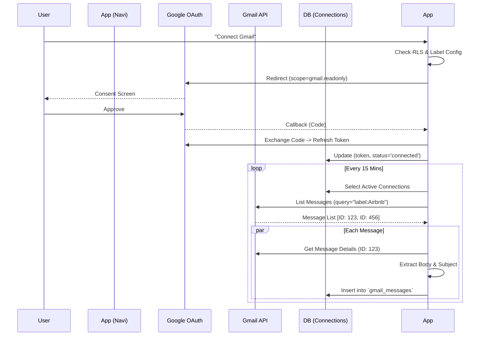

# Connections System Architecture
**Date:** January 28, 2026

## Connectivity Flow

## Data Schema Details

### `connections` Table
- `id`: UUID (Primary Key)
- `workspace_id`: Relationship to Workspace.
- `reservation_label`: (String) The Gmail label to scrape. Essential.
- `gmail_status`: 'connected' | 'disconnected' | 'error'.
- `gmail_refresh_token`: (Text, Encrypted*) The long-lived credential. 
  *(Encryption depends on Supabase Vault usage, currently text for MVP).*

## Integration Points
- **Google OAuth:** Used purely for authorization. We do not use Google Sign-In for identity here (that's the Auth system); this is strictly for resource access.
- **Gmail API:** Specifically `users.messages.list` and `users.messages.get`.

## Scalability
- **Rate Limits:** Google imposes rate limits (user-rate-limit).
- **Strategy:** Sequential processing per connection prevents hitting concurrency limits.
- **Batching:** We fetch in batches of 20-50 emails to avoid timeouts.
