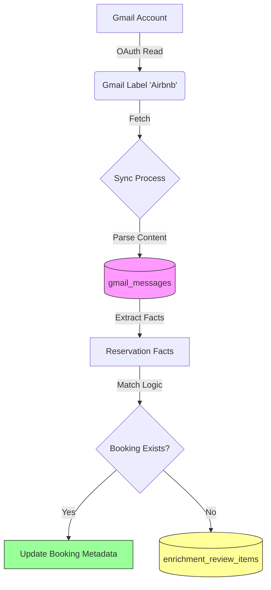

# Connections System Architecture

**Version:** 1.0 (Draft)
**Date:** Jan 27, 2026

## 1. High-Level Architecture

The Connections system operates as a **unidirectional ingestion pipeline**. It pulls data from Gmail labels, archives raw content, and then selectively "hydrates" existing database records (Bookings) or creates review tasks.

## 2. Key Data Structures

### `connections`
Stores the link between a Workspace and a Gmail account.
*   `id`: UUID (Primary Key)
*   `workspace_id`: The owning workspace context (Security Boundary).
*   `platform`: Classification (`airbnb`, `vrbo`, `booking`, `pms`).
*   `reservation_label`: The **critical config**. Exact name of the label in Gmail to watch.
*   `gmail_status`: `connected` | `error` | `pending`.
*   `gmail_access_token` / `refresh_token`: OAuth credentials.

### `gmail_messages`
The immutable "Tape of Truth". Every processed email is logged here first.
*   `gmail_message_id`: Google's unique ID. Used for idempotency.
*   `connection_id`: Owner of this message.
*   `raw_metadata`: JSON containing `full_text`, `full_html`, `headers`.
*   `processed_at`: Ingestion timestamp.

### `reservation_facts` (Intermediate)
Transient storage of extracted data before it matches a booking.
*   `guest_name`, `check_in`, `check_out`, `confirmation_code`.
*   `confidence`: Score of extraction validity.

### `bookings` (Source: iCal)
The target for enrichment.
*   `source_feed_id`: Link to iCal feed (Primary Source of Truth).
*   `guest_name`: Updated by Connections system.
*   `guest_count`: Updated by Connections system.
*   `raw_data`: Stores `enrichment_reason` (e.g., "Code Match", "Exact Date").

## 3. Key API Routes

### 1. OAuth Handshake
*   **Start:** `GET /api/cohost/connections/[id]/gmail/start`
    *   Verifies workspace ownership.
    *   Redirects to Google with `state=connectionId`.
*   **Callback:** `GET /api/cohost/connections/gmail/callback`
    *   Exchanges code for tokens.
    *   **Verifies Label:** Immediately checks if the configured `reservation_label` exists in the Gmail account.
    *   Updates `gmail_status`.

### 2. Synchronization
*   **Sync:** `POST /api/cohost/connections/[id]/sync`
    *   **Locking:** Acquires in-memory lock for `connection_id`.
    *   **Process:**
        1.  Scrapes new emails from Gmail Label -> `gmail_messages`.
        2.  Extracts data -> `reservation_facts`.
        3.  Enriches -> `bookings`.
    *   **Response:** JSON stats (`emails_scanned`, `bookings_enriched`).

### 3. Health
*   **Status:** `GET /api/cohost/connections/[id]/health` (Implicit via UI fetch)
    *   Returns current `gmail_status` and last sync timestamps.

## 4. Guardrails & Safety
*   **Workspace Isolation:** All queries filter by `workspace_id`. Cross-workspace access returns `403`.
*   **Duplicate Prevention:** `gmail_message_id` is unique per connection. Re-processing checks `existingRows`.
*   **Label Conflict:** If two connections in the same workspace try to use the EXACT same label name, the sync fails with `409 LABEL_CONFLICT`.
*   **Write-Only Bookings:** The processor is hard-coded to `UPDATE` bookings, never `INSERT`.

## 5. Known Failure Modes

| Error | Context | Meaning |
| :--- | :--- | :--- |
| `LABEL_NOT_FOUND` | Verification | The label name saved in DB does not exist in the Gmail account. |
| `LABEL_NOT_CONFIGURED` | Verification | User tried to connect without saving a label name first. |
| `SYNC_IN_PROGRESS` | Sync | Checks lock file/memory. Previous sync is still running. |
| `invalid_grant` | Sync/Verify | OAuth token revoked or expired. User must reconnect. |

## 6. Observability
The following structured logs are emitted to the server console (and captured by log drain):

*   `[EmailProcessor]`: High-volume tracing of message parsing.
    *   `event: 'gmail_ingest_run'`: Summary of a sync job (scanned, skipped, count).
    *   `event: 'label_isolation_violation'`: Critical alert for shared label detected.
*   `[GmailVerify]`: OAuth and Label verification steps.
    *   `event: 'connection_health'`: Status transitions (`connected` -> `error`).
*   `[Sync]`: End-to-end job performance.
    *   `event: 'sync_run_end'`: Duration and success/fail outcome.
