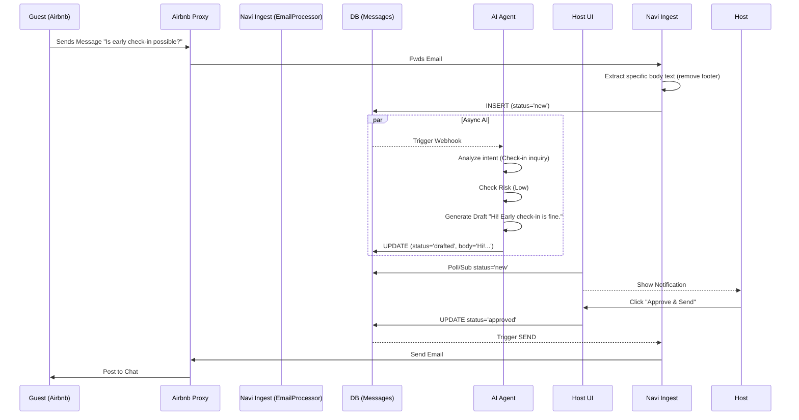

# Inbox Architecture
**Date:** January 28, 2026

## Messaging Flow

## Data Model

### `cohost_conversations`
The anchor for a chat.
- `id`: UUID.
- `property_id`: Links to the property discussion is about.
- `guest_email`: The proxy email (`...@guest.airbnb.com`).
- `platform`: 'airbnb', 'vrbo', 'direct'.

### `cohost_messages`
The individual bubbles.
- `direction`: `inbound` (Guest -> Host) or `outbound` (Host -> Guest).
- `status`: `new` -> `drafted` -> `approved` -> `sent`.
- `ai_meta`: JSONB column storing `{ intent: "early_checkin", sentiment: "neutral" }`.

## Integration Points
- **SendGrid / Gmail API:** Used for the actual transport layer.
- **OpenAI:** Used for the `drafted` and `risk_score` logic.
- **Supabase Realtime:** Updates the Host UI instantly when a new message arrives.
