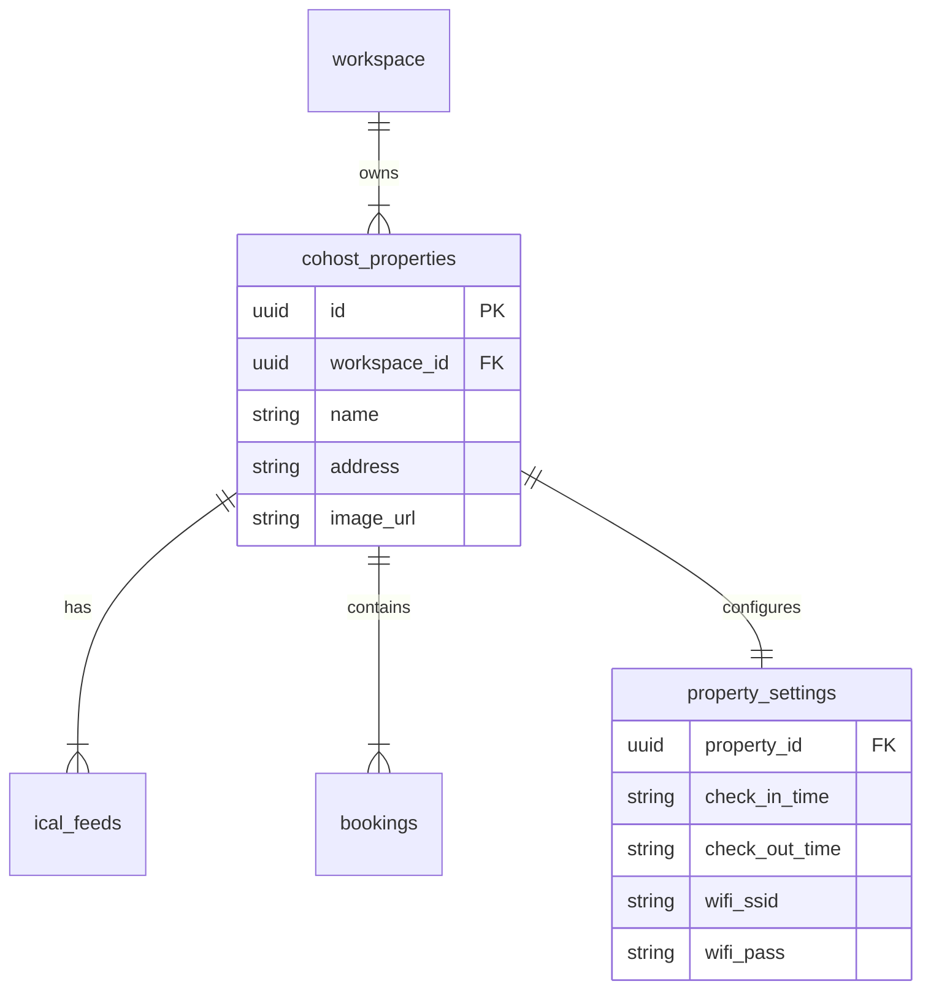

# Properties Architecture
**Date:** January 28, 2026

## Data Model & Hierarchy

## Workflows

### 1. Creation (Manual)
1. User submits form.
2. `supabase.from('cohost_properties').insert()` called from Client.
3. RLS checks if User belongs to the `workspace_id` in the payload.
4. Success: Row created.

### 2. Creation (Import)
1. Client POSTs URL to `/api/cohost/properties/import`.
2. Server fetches URL (Airbnb/VRBO).
3. Server parses generic meta tags (`og:title`, `og:image`).
4. Server returns JSON object `{ name, image_url, address }`.
5. Client populates the "New Property" form with this data.
6. User reviews and saves (Standard Creation Flow).

### 3. Deletion
1. Client requests deletion.
2. Database `ON DELETE CASCADE` triggers remove related `ical_feeds` and `bookings`.
   - *Note:* We rely on Postgres foreign keys for cleanup to ensure consistency.

## Performance
- **Caching:** Property lists are cached by React Query (or similar) on the client.
- **Images:** We currently store hotlinked URLs. In the future, we may need a proxy or storage bucket to prevent "link rot" or hotlinking protections from external sites.
