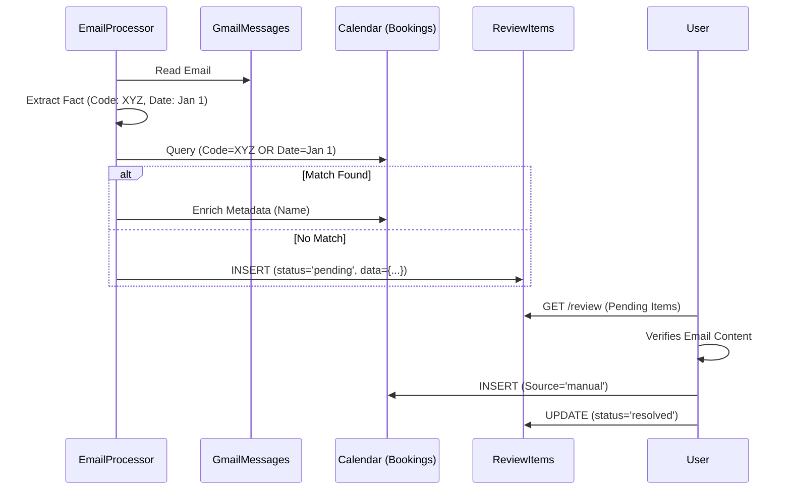

# Review System Architecture
**Date:** January 28, 2026

## Detection Flow

## Schema

### `enrichment_review_items`
- `extracted_data`: JSONB. Contains `{ guest_name, check_in, check_out, confirmation_code, listing_name }`.
- `connection_id`: Which Gmail account found this.
- `workspace_id`: Scope.

## Integration
- **Tightly coupled with `EmailProcessor`.**
- **Loosely coupled with `Calendar`.** The Review system observes the calendar but does not modify it.
